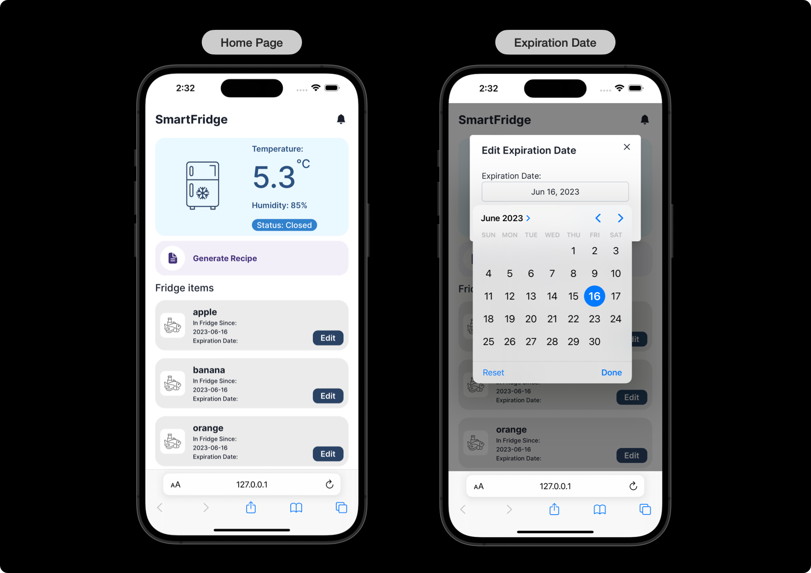
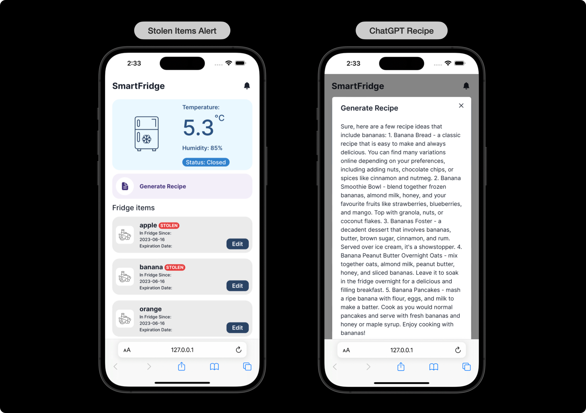
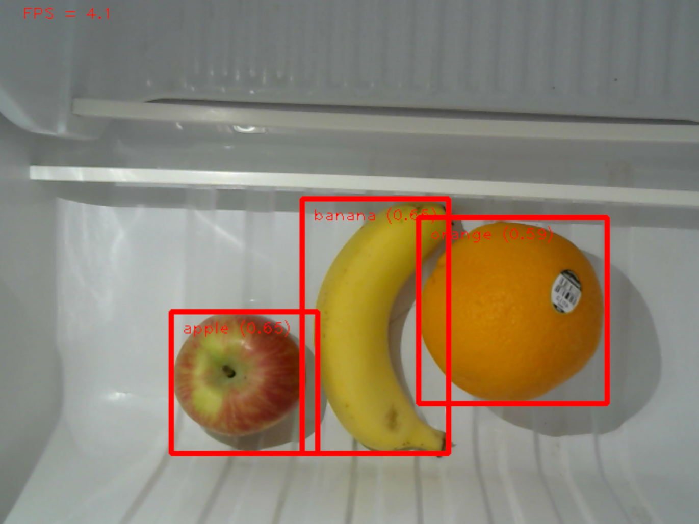

# AIoT Smart Fridge System
Smart Fridge monitors your fridge, alerts you when food is about to expire, or when someone steals your food. 
In addition, it can generate recipe based on items in fridge with the help of ChatGPT.

## Features
- Temperature and Humidity Sensor
  - monitor fridge temperature and humidity
- Food recognition
  - detect food items in fridge
- Expiration alert
  - alert user when food is about to expire
- Food Protection
  - face detection to identify the person opening the fridge
- Recipe with ChatGPT
  - generate recipe based on items in fridge
- Web UI
  - monitor fridge state
  - visualize items in fridge
  - alert when someone steals your food
  - alert when food is about to expire
  - generate recipe with ChatGPT

## Hardware
- Raspberry Pi 4B x3
- Sensors
  - Temperature and Humidity Sensor
  - Camera Module (Webcam)

## Frontend Web UI
[SmartFridge](https://github.com/ANITA-0604/SmartFridge) is the frontend codebase developed using Next.js.

## Backend
Python Flask server that
- Provides API endpoints for frontend and other Raspberry Pi
- Uses Redis DB to store fridge state and items in fridge

## Object Detection
Raspberry Pi on-device detection using YOLO-v5

  

## Face Detection
