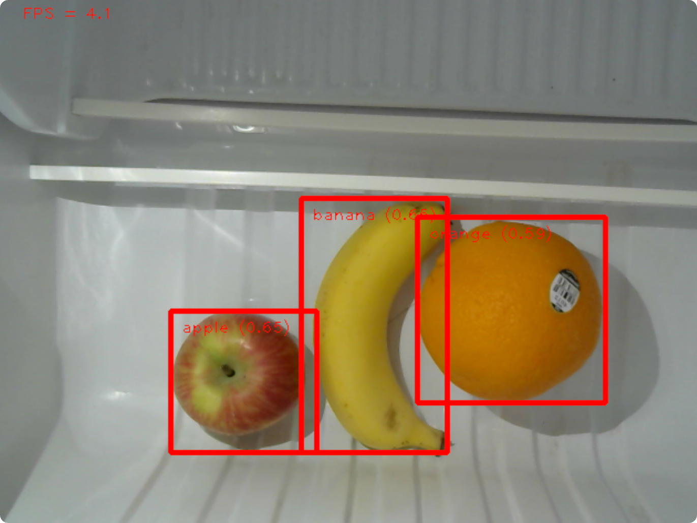

# AIoT Smart Fridge System

## Introduction
Smart Fridge comes with food recognition, expiration alert, face detection, and a web UI to monitor fridge state, visualize items in fridge, and generate recipe with ChatGPT.

  

    
Home page

    
  

  

    
Expiration date

    
  

  

    
Stolen items

    
  

  

    
ChatGPT recipe

    
  

## Hardware
- Raspberry Pi 4B x3
- Sensors
  - Temperature and Humidity Sensor
  - Camera Module (Webcam)

## Frontend Web UI
[SmartFridge](https://github.com/ANITA-0604/SmartFridge) is the frontend codebase developed using Next.js.

## Backend
Python Flask server that
- Provides API endpoints for frontend and other Raspberry Pi
- Uses Redis DB to store fridge state and items in fridge

## Object Detection
Raspberry Pi on-device detection using YOLO-v5

  

## Face Detection
